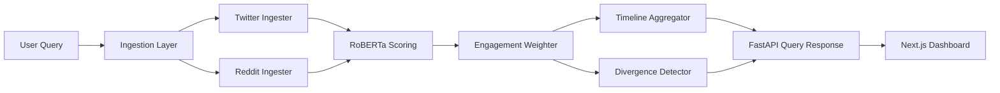

# Recombyne Architecture

## High-Level Data Flow

## Service Responsibilities
- `services/ingestion`: source-specific API clients and normalized `RawPost` output.
- `services/scoring`: RoBERTa sentiment inference and engagement weighting.
- `services/aggregation`: timeline construction and divergence explanation generation.
- `routers`: HTTP contracts for querying, health checks, and key validation.
- `utils/cache.py`: short-lived query result caching by `query_id`.

## Database Schema Overview
- `posts`: normalized social content with source and text fields.
- `sentiments`: sentiment outputs keyed by `post_id`.
- `topics`: saved topics for recurring tracking.
- `user_keys`: key validation metadata without storing raw secrets.

## Caching Strategy
- Query responses are cached in-memory by `query_id` with TTL.
- Redis is configured for future distributed cache and job queue use.
- Timeline and weighted output are cached as a full response bundle.

## Rate Limiting Approach
- Twitter ingestion retries with exponential backoff on `429` errors.
- Reddit ingestion catches PRAW core exceptions and surfaces clear messages.
- Future improvements include per-source token bucket controls in Redis.
